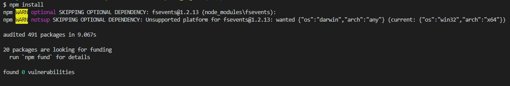
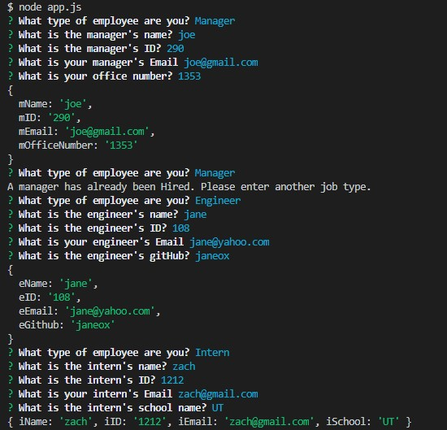
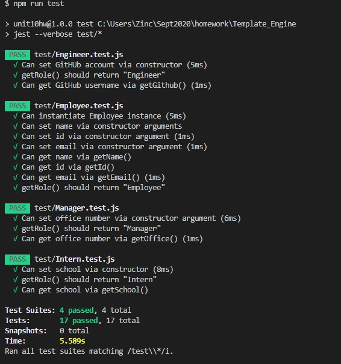

# Template_Engine

## Description
This is a command-line application that runs with Node.js that generates a a webpage of a company or project team. This webpage displays employee summary cards which include one Manager, and at least one or more Engineer's and Intern's. Important information, such as name, employee id, and their email are displayed for each role. There is also a role specific information that is displayed for each job type.

* [Installation](#Installation)

* [Usage](#Usage)

* [Contributors](#Contributors)

* [Tests](#Tests)

* [Questions](#Questions)

## Installation
Clone the repo to your own computer using Terminal/GitBash. Once cloned, open terminal/bash in the location of the app.js file. Then type the command: npm install, this will allow the package inquirer to be installed.

Here is a video on how to install and use this application.
[Video Tutorial Link](https://drive.google.com/file/d/1hfCGBRastJCiChTec2WQw4c7y51VuLy-/view)

## Usage
Once installation has completed, open terminal/bash to the folder with app.js, if not there already. Then type the command code: node app.js. You will then be prompted with questions to answer inside of the terminal. These answers will generate an html file.

## Contributors
zach-greenberg

## Tests
This application has tests to catch errors with in the test folder. The developer can install jest with npm install along with inquirer. Once installed, with in the terminal/bash type the command code: npm run test

## Questions
**Please ask any questions to the following**

Email: test123@testemail.com

GitHub: https://github.com/zach-greenberg